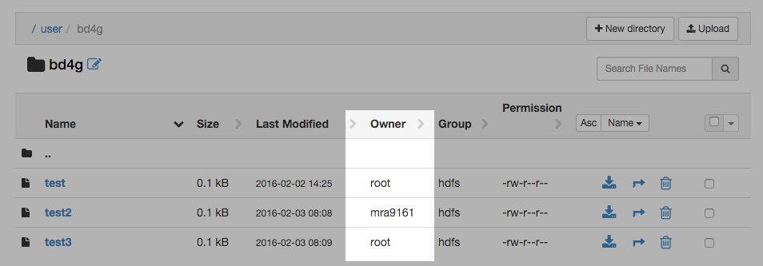

# Creating a file on HDFS via Java

Most of the Hadoop tools assume the code is executing on a Hadoop cluster.  Configuration files are found automatically and everything is easy.  However, this makes development difficult, as the Java code would need to be executed on the Hadoop cluster.  How would we access the HDFS remotely?

## Programatic configuration

The `org.apache.hadoop.conf.Configuration.Configuration` class is the key to programatically setting up our connection information.

```java
 Configuration conf = new Configuration();
 conf.set("fs.defaultFS", "hdfs://127.0.0.1:8020/");
 
FileSystem fs = FileSystem.get(conf);
```

By default, Hadoop will connect as the current local user, but this can be changed through the environment variable `HADOOP_USER_NAME`.

```java
System.setProperty("HADOOP_USER_NAME", "root");
```

In the test code, I created files with different users (`root` and `mra9161`):

```
fs.createNewFile(new Path("/user/bd4g/test"));
fs.createNewFile(new Path("/user/bd4g/test2"));
fs.createNewFile(new Path("/user/bd4g/test3"));
```

reflected in HDFS:

