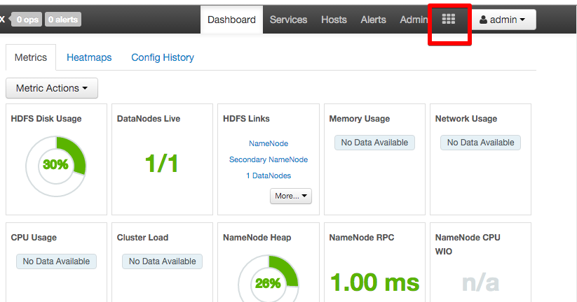
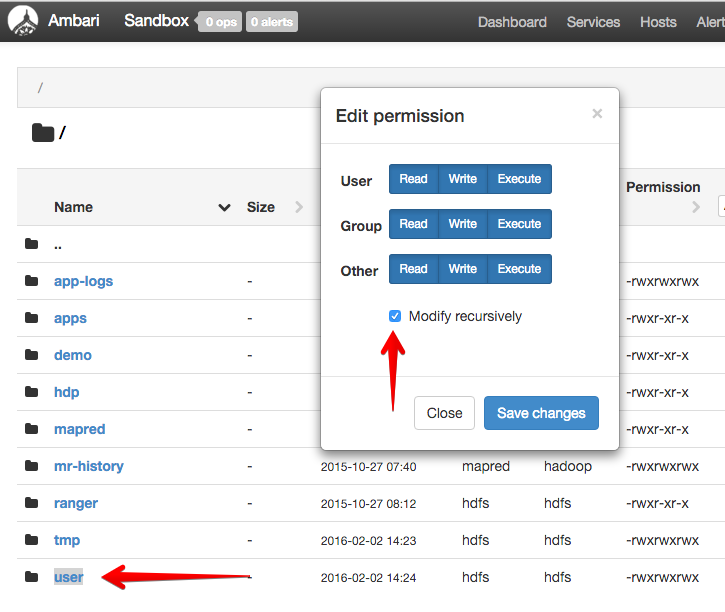

# Setting up Hortonworks HDP Sandbox

Download the [sandbox environment](http://hortonworks.com/products/hortonworks-sandbox/#install) from HortonWorks.  The Sandbox is **batteries included** and quite useful for playing around.

## Sysadmin on Sandbox VM

Shell access to the Sandbox VM is available the web at [http://localhost:4200/](http://localhost:4200/) or via ssh (`ssh -p 2222 root@127.0.0.1`).  Change the root password to `h0rt0nw0rks` by logging in using the default password `hadoop`.

Change the DNS server from Google's DNS (`8.8.8.8`) and add `mayo.edu` as the domain lookup in `/etc/sysconfig/network-scripts/ifcfg-eth0`.

```
cat << 'EOF' > /etc/sysconfig/network-scripts/ifcfg-eth0
DEVICE="eth0"
BOOTPROTO="dhcp"
DHCP_HOSTNAME="sandbox.hortonworks.com"
DNS1="129.176.171.5"
DOMAIN="mayo.edu"

IPV6INIT="no"
ONBOOT="yes"
TYPE="Ethernet"

NM_CONTROLLED=no
PEERDNS=no
EOF
```

Then change `resolv.conf`:

```bash
cat << 'EOF' > /etc/resolv.conf
search mayo.edu
nameserver 129.176.171.5
EOF
```

## Sysadmin on host machine

The Sandbox VM is named `sandbox.hortonworks.com` and some operations on clients depend on DNS lookups correctly resolving to the VM.  Because the VM runs using `NAT` addressing under VirtualBox with port forwarding enabled, the host machine needs to be able to resolve `sandbox.hortonworks.com` to `localhost` or `127.0.0.1`.  This is accomplished by adding an entry in `/etc/hosts`.  **NB:** seems that VPN access resets this file, so the entry may need to be added for every session.

```
sudo tee -a /etc/hosts > /dev/null <<'EOF'
127.0.0.1  sandbox.hortonworks.com
EOF
```

Now restart the DNS cache:

```
sudo killall -HUP mDNSResponder
```

To verify use `ping`.  `dig` and `nslookup` hit nameservers only, bypassing any changes to `/etc/hosts`.  

```
39: ping sandbox.hortonworks.com
PING sandbox.hortonworks.com (127.0.0.1): 56 data bytes
64 bytes from 127.0.0.1: icmp_seq=0 ttl=64 time=0.041 ms
```

## Granting HDFS permissions

By default, the HDFS is rather locked down.  Create a HDFS directory called `/user/db4g` through the [Ambari](https://ambari.apache.org/) interface accessable at [http://localhost:8080](http://localhost:8080)  username `admin`, password `admin`.

Start by finding the `HDFS Files` view from the Ambari home page:



Next, right click on `user` and change permissions to be completely open to all, being sure to check `Modify recursively`:



Now the HDFS is ready to roll!

## Changing Java to 1.8

Changing the Sandbox to Java 8 [is well documented by HortonWorks](http://docs.hortonworks.com/HDPDocuments/Ambari-2.1.1.0/bk_ambari_reference_guide/content/ch_changing_the_jdk_version_on_an_existing_cluster.html) and is relatively simple.

```bash
[root@sandbox ~]# ambari-server setup
<snip>
Do you want to change Oracle JDK [y/n] (n)? y
[1] Oracle JDK 1.8 + Java Cryptography Extension (JCE) Policy Files 8
[2] Oracle JDK 1.7 + Java Cryptography Extension (JCE) Policy Files 7
[3] Custom JDK
==============================================================================
Enter choice (1): 1
```

May want to reboot for good measure.  On a cluster, all the machines have to have Java 8 installed in the same path.